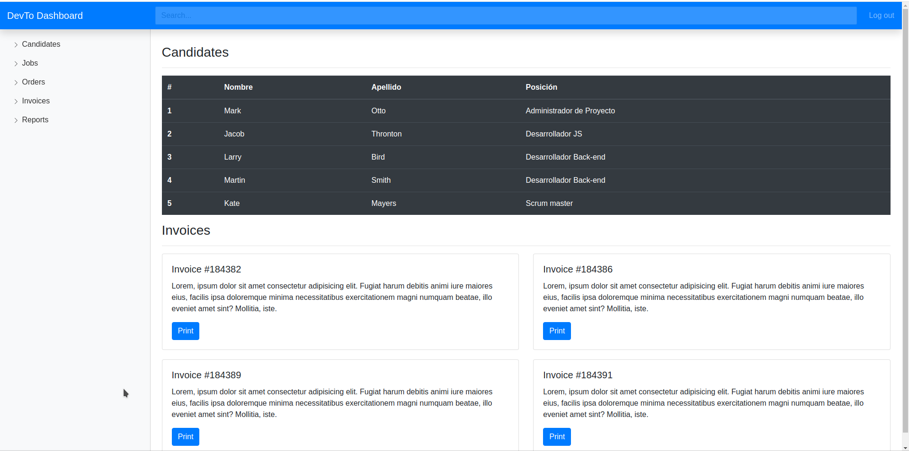

# Bootstrap dashboard

This is a project based on a tutorial from [How to create a simple dashboard using Bootstrap in 5 minutes?](https://dev.to/duomly/how-to-create-a-simple-dashboard-using-bootstrap-in-5-minutes-2p4o) by [Duomly](https://dev.to/duomly).

I followed this tutorial to get some practice on vscode and the usage of Emmet abbreviations.

Heres a result snapshot
___

